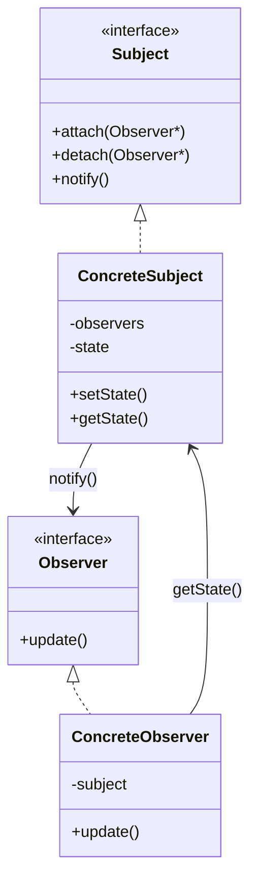

# Observer Pattern

## Intent

Define a one-to-many dependency between objects so that when one object (the Subject) changes its state, all of its dependent objects (Observers) are notified and updated automatically.

The Observer Pattern allows objects to communicate without being tightly coupled.

---

## Motivation

Imagine a YouTube channel.

Whenever a creator uploads a new video:

- All subscribers receive a notification.
- New subscribers can subscribe at any time.
- Existing subscribers can unsubscribe at any time.

Without the Observer Pattern, the channel would need to directly call every subscriber, making it tightly coupled to them.

With the Observer Pattern, the channel simply notifies all registered subscribers without knowing their concrete implementations.

---

## When to Use

- When one object's state change should automatically notify multiple objects.
- When the sender should not depend on the concrete implementations of receivers.
- When observers need to be added or removed dynamically.
- When following the Open/Closed Principle.

### Examples

- YouTube notification system.
- Weather station updates.
- Stock market price notifications.
- Chat applications.
- GUI event handling.
- Logging and monitoring systems.

---

## Participants

### Subject (Publisher)

- Maintains a list of observers.
- Allows observers to subscribe and unsubscribe.
- Notifies all observers whenever its state changes.

### Concrete Subject

- Stores the actual state.
- Implements the Subject interface.
- Calls `notify()` whenever its state changes.

### Observer (Subscriber)

- Declares the `update()` interface.
- Receives notifications from the subject.

### Concrete Observer

- Implements the Observer interface.
- Registers with the subject.
- Reacts whenever it receives a notification.
- In the Pull Model, it may query the subject for updated data.

---

## UML Diagram



---

## Implementation

### Naive Version

```cpp
class YouTubeChannel
{
public:
    void uploadVideo()
    {
        alice.notify();
        bob.notify();
        charlie.notify();
    }
};
```

### Problems

- Tight coupling between the subject and observers.
- Every new observer requires modifying the subject.
- Violates the Open/Closed Principle.
- Difficult to maintain as the number of observers grows.

---

## Observer Pattern Version

### Observer Interface

```cpp
class Observer
{
public:
    virtual void update() = 0;
    virtual ~Observer() = default;
};
```

---

### Subject Interface

```cpp
class Subject
{
public:
    virtual void attach(Observer*) = 0;
    virtual void detach(Observer*) = 0;
    virtual void notify() = 0;

    virtual ~Subject() = default;
};
```

---

### Concrete Subject

```cpp
class ConcreteSubject : public Subject
{
private:
    std::vector<Observer*> observers;
    int state = 0;

public:

    void attach(Observer* observer) override;
    void detach(Observer* observer) override;
    void notify() override;

    void setState(int state);
    int getState() const;
};
```

---

### Concrete Observer

```cpp
class ConcreteObserver : public Observer
{
private:
    ConcreteSubject* subject;

public:
    ConcreteObserver(ConcreteSubject* subject);

    void update() override;
};
```

---

### Client Code

```cpp
int main()
{
    ConcreteSubject subject;

    ConcreteObserver observer1(&subject);
    ConcreteObserver observer2(&subject);

    subject.attach(&observer1);
    subject.attach(&observer2);

    subject.setState(100);

    subject.detach(&observer2);

    subject.setState(200);
}
```

---

## Push vs Pull Model

### Push Model

The Subject sends all required data to observers.

```cpp
update(int state)
```

### Advantages

- Observer does not need access to the subject.
- Fewer method calls.

### Disadvantages

- Subject may send unnecessary information.

---

### Pull Model (GoF Standard)

The Subject only notifies observers.

```cpp
update()
```

Observers retrieve the required data themselves.

```cpp
subject->getState();
```

### Advantages

- Observer requests only the information it needs.
- More flexible.

### Disadvantages

- Requires the observer to maintain a reference to the subject.

---

## Advantages

- Loose coupling between Subject and Observers.
- Supports the Open/Closed Principle.
- Observers can be added or removed dynamically.
- One change automatically updates multiple dependent objects.
- Encourages event-driven programming.

---

## Disadvantages

- Large numbers of observers can impact performance.
- Notification order may not be guaranteed.
- More difficult to debug because updates are indirect.
- Improper implementation may lead to cascading notifications or update loops.
- Requires careful lifetime management of observer references.

---

## Common Use Cases

- Notification systems
- Weather monitoring
- Stock market applications
- GUI event handling
- Chat applications
- Logging systems
- Game event systems
- File system watchers
- IoT sensor monitoring

---

## Summary

| Feature | Description |
|----------|-------------|
| Pattern Type | Behavioral |
| Intent | Notify multiple dependent objects automatically when the subject changes |
| Core Participants | Subject, ConcreteSubject, Observer, ConcreteObserver |
| Relationship | One Subject → Many Observers |
| Communication | Notification (`notify()` → `update()`) |
| Standard GoF Model | Pull Model |
| Main Benefit | Loose coupling between publisher and subscribers |
| Main Drawback | Notification overhead and lifetime management |