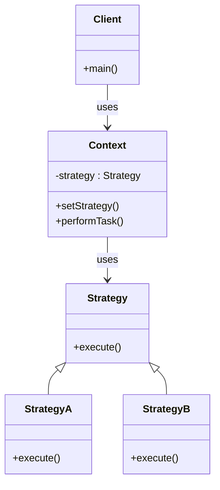

# Strategy Pattern

## Intent

Define a family of algorithms, encapsulate each one in a separate class, and make them interchangeable at runtime.

The Strategy Pattern lets a client choose an algorithm dynamically without modifying the code that uses it.

---

## Motivation

Imagine a navigation application.

A user may want directions using:

- Car Route
- Bike Route
- Walking Route
- Public Transport Route

Without the Strategy Pattern, the navigation class would contain many `if-else` or `switch` statements.

With the Strategy Pattern, each routing algorithm becomes a separate strategy that can be selected at runtime.

---

## When to Use

- When multiple algorithms can solve the same problem.
- When you want to avoid large `if-else` or `switch` blocks.
- When algorithm selection should happen at runtime.
- When following the Open/Closed Principle (adding new algorithms without modifying existing code).

### Examples

- Payment methods (Credit Card, UPI, PayPal).
- Sorting strategies.
- Compression algorithms.
- Navigation routes.
- Discount calculation systems.
- Authentication mechanisms.

---

### UML Diagram



---

## Implementation

### Naive Version

```cpp
class PaymentService {
public:
    void pay(string method) {
        if(method == "UPI")
            cout << "Paid using UPI";
        else if(method == "CARD")
            cout << "Paid using Card";
        else if(method == "PAYPAL")
            cout << "Paid using PayPal";
    }
};
```

### Problems

- Violates Open/Closed Principle.
- Every new payment method requires modifying existing code.
- Difficult to test and maintain.

---

### Strategy Pattern Version

#### Strategy Interface

```cpp
class PaymentStrategy {
public:
    virtual void pay(int amount) = 0;
    virtual ~PaymentStrategy() = default;
};
```

#### Concrete Strategies

```cpp
class UpiPayment : public PaymentStrategy {
public:
    void pay(int amount) override {
        cout << "Paid " << amount << " using UPI\n";
    }
};

class CardPayment : public PaymentStrategy {
public:
    void pay(int amount) override {
        cout << "Paid " << amount << " using Card\n";
    }
};
```

#### Context

```cpp
class PaymentContext {
private:
    PaymentStrategy* strategy;

public:
    PaymentContext(PaymentStrategy* strategy)
        : strategy(strategy) {}

    void setStrategy(PaymentStrategy* newStrategy) {
        strategy = newStrategy;
    }

    void makePayment(int amount) {
        strategy->pay(amount);
    }
};
```

#### Client Code

```cpp
int main() {
    UpiPayment upi;
    CardPayment card;

    PaymentContext payment(&upi);
    payment.makePayment(1000);

    payment.setStrategy(&card);
    payment.makePayment(2000);
}
```

---

## Advantages

- Eliminates complex conditional logic.
- Supports Open/Closed Principle.
- Algorithms can be changed at runtime.
- Easier testing and maintenance.
- Promotes composition over inheritance.

---

## Disadvantages

- Increases the number of classes.
- Client must know which strategy to choose.
- Slight overhead due to additional abstraction.

---
