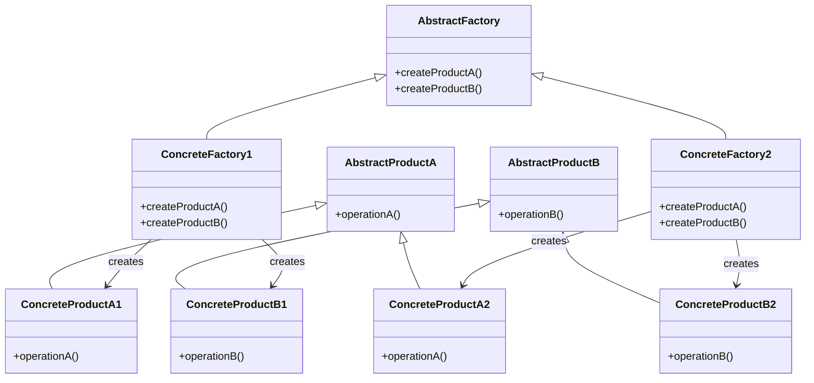

# Abstract Factory Pattern

## Intent

Provide an interface for creating **families of related or dependent objects** without specifying their concrete classes.

The Abstract Factory Pattern is essentially a **factory of factories**, ensuring that related products are created together and remain compatible.

---

## Motivation

Imagine a UI toolkit that supports multiple operating systems:

* Windows UI
* Mac UI
* Linux UI

Each OS has its own set of related components:

* Button
* Checkbox
* Scrollbar

Without Abstract Factory, you might mix incompatible components (e.g., Windows Button + Mac Checkbox).

With Abstract Factory, you ensure:

> A single factory produces a complete family of related products.

---

## When to Use

* When a system must support multiple families of related products.
* When you want to ensure product compatibility within a family.
* When you want to switch entire product families at runtime.
* When you want to enforce consistency among related objects.
* When following Open/Closed Principle at the family level.

### Examples

* Cross-platform UI toolkits (Windows, Mac, Linux)
* Game engines (Easy mode vs Hard mode assets)
* Database abstraction layers (SQL vs NoSQL components)
* Theme systems (Dark theme vs Light theme)
* Cloud providers (AWS vs Azure vs GCP services)

---

## UML Diagram



---

## Implementation

---

### Abstract Products

```cpp id="afp1"
class Button {
public:
    virtual void render() = 0;
    virtual ~Button() = default;
};

class Checkbox {
public:
    virtual void render() = 0;
    virtual ~Checkbox() = default;
};
```

---

### Concrete Products (Family 1 - Windows)

```cpp id="afp2"
class WindowsButton : public Button {
public:
    void render() override {
        cout << "Rendering Windows Button\n";
    }
};

class WindowsCheckbox : public Checkbox {
public:
    void render() override {
        cout << "Rendering Windows Checkbox\n";
    }
};
```

---

### Concrete Products (Family 2 - Mac)

```cpp id="afp3"
class MacButton : public Button {
public:
    void render() override {
        cout << "Rendering Mac Button\n";
    }
};

class MacCheckbox : public Checkbox {
public:
    void render() override {
        cout << "Rendering Mac Checkbox\n";
    }
};
```

---

### Abstract Factory

```cpp id="afp4"
class GUIFactory {
public:
    virtual unique_ptr<Button> createButton() = 0;
    virtual unique_ptr<Checkbox> createCheckbox() = 0;
    virtual ~GUIFactory() = default;
};
```

---

### Concrete Factories

```cpp id="afp5"
class WindowsFactory : public GUIFactory {
public:
    unique_ptr<Button> createButton() override {
        return make_unique<WindowsButton>();
    }

    unique_ptr<Checkbox> createCheckbox() override {
        return make_unique<WindowsCheckbox>();
    }
};

class MacFactory : public GUIFactory {
public:
    unique_ptr<Button> createButton() override {
        return make_unique<MacButton>();
    }

    unique_ptr<Checkbox> createCheckbox() override {
        return make_unique<MacCheckbox>();
    }
};
```

---

### Client Code

```cpp id="afp6"
int main() {
    unique_ptr<GUIFactory> factory;

    // Switch entire product family at runtime
    factory = make_unique<WindowsFactory>();

    auto button1 = factory->createButton();
    auto checkbox1 = factory->createCheckbox();

    button1->render();
    checkbox1->render();

    factory = make_unique<MacFactory>();

    auto button2 = factory->createButton();
    auto checkbox2 = factory->createCheckbox();

    button2->render();
    checkbox2->render();

    return 0;
}
```

---

## Advantages

* Ensures **compatibility between related products**
* Promotes consistency across product families
* Easy to switch entire families at runtime
* Follows Open/Closed Principle at the family level
* Clean separation between product creation and usage

---

## Disadvantages

* Adds many classes and interfaces
* Hard to extend with new product types (not just families)
* Can become rigid if product families change frequently
* Increased complexity compared to Factory Method

---

## Key Difference (Important)

| Pattern          | Focus                                       |
| ---------------- | ------------------------------------------- |
| Factory Method   | One product type → multiple implementations |
| Abstract Factory | Multiple related products → one family      |

---

## Key Idea

“Factory Method creates one product. Abstract Factory creates a whole family of products that belong together.”

---
