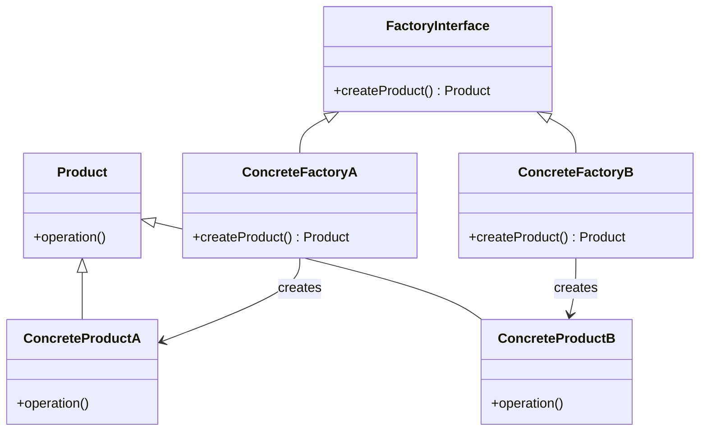

# Factory Method Pattern

## Intent

Define an interface for creating an object, but let subclasses decide which class to instantiate.

The Factory Method Pattern delegates object creation to concrete factory classes instead of using conditional logic.

---

## Motivation

Imagine a system that creates different types of products:

* Type A Product
* Type B Product
* Type C Product

Each product has its own creation logic.

Without Factory Method Pattern, a single factory would contain `if-else` or `switch` logic for every product type.

With Factory Method Pattern, each concrete factory is responsible for creating exactly one product type.

---

## When to Use

* When object creation should be delegated to subclasses.
* When the system should not depend on concrete product classes.
* When you want to follow Open/Closed Principle strictly.
* When creation logic varies per product type.
* When frameworks want to allow extensible object creation.

### Examples

* Vehicle creation systems
* UI frameworks (buttons, dialogs)
* Game enemy spawning systems
* Document creation (PDF, Word, Excel)
* Notification systems (Email, SMS, Push)
* Database driver factories

---

## UML Diagram



---

## Implementation

### Product Interface

```cpp
class Product {
public:
    virtual void operation() = 0;
    virtual ~Product() = default;
};
```

---

### Concrete Products

```cpp
class ConcreteProductA : public Product {
public:
    void operation() override {
        cout << "Product A operation\n";
    }
};

class ConcreteProductB : public Product {
public:
    void operation() override {
        cout << "Product B operation\n";
    }
};
```

---

### Factory Interface

```cpp
class FactoryInterface {
public:
    virtual unique_ptr<Product> createProduct() = 0;
    virtual ~FactoryInterface() = default;
};
```

---

### Concrete Factories

```cpp
class ConcreteFactoryA : public FactoryInterface {
public:
    unique_ptr<Product> createProduct() override {
        return make_unique<ConcreteProductA>();
    }
};

class ConcreteFactoryB : public FactoryInterface {
public:
    unique_ptr<Product> createProduct() override {
        return make_unique<ConcreteProductB>();
    }
};
```

---

### Client Code

```cpp
int main() {
    unique_ptr<FactoryInterface> factory;

    factory = make_unique<ConcreteFactoryA>();
    factory->createProduct()->operation();

    factory = make_unique<ConcreteFactoryB>();
    factory->createProduct()->operation();

    return 0;
}
```

---

## Advantages

* Removes conditional object creation logic.
* Follows Open/Closed Principle strictly.
* Decouples client from concrete products.
* Easy to extend with new products.
* Improves code organization in large systems.

---

## Disadvantages

* Increases number of classes.
* Client still needs to choose the correct factory.
* Can be overkill for simple object creation.
* Slightly more complex than Simple Factory.

---
