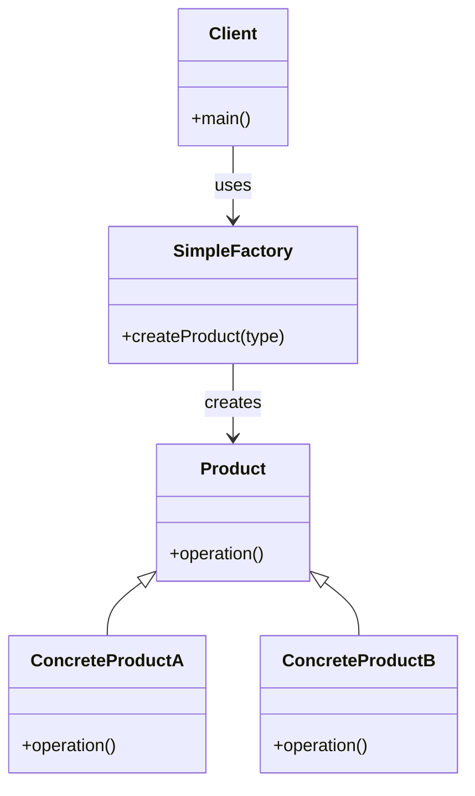

# Simple Factory Pattern

## Intent

Provide a single factory class that creates objects based on input without exposing the instantiation logic to the client.

The Simple Factory Pattern centralizes object creation so the client only requests objects, not constructs them.

---

## Motivation

Imagine a logging system.

The application may need different loggers:

* Console Logger
* File Logger
* Database Logger

Without a factory, the client must decide which class to instantiate using `if-else` or `switch`.

With a Simple Factory, object creation is moved to a single factory class.

---

## When to Use

* When object creation logic is simple but varies by type.
* When you want to centralize object creation.
* When you want to hide instantiation details from the client.
* When you want to avoid repeated `new` logic across the codebase.

### Examples

* Notification system (Email, SMS, Push).
* Payment object creation (UPI, Card, Wallet).
* Shape creation (Circle, Square, Rectangle).
* Database connection selection.
* Logger creation.
* Parser selection (JSON, XML, CSV).

---

### UML Diagram



---

## Implementation

### Naive Version (Without Factory)

```cpp
class Logger {
public:
    void log(string type, string message) {
        if (type == "CONSOLE")
            cout << "Console: " << message << endl;
        else if (type == "FILE")
            cout << "File: " << message << endl;
        else if (type == "DB")
            cout << "DB: " << message << endl;
    }
};
```

### Problems

* Violates Open/Closed Principle.
* Object creation logic is scattered.
* Hard to extend with new logger types.
* Tight coupling between client and implementations.

---

## Simple Factory Version

### Product Interface

```cpp
class Logger {
public:
    virtual void log(string message) = 0;
    virtual ~Logger() = default;
};
```

---

### Concrete Products

```cpp
class ConsoleLogger : public Logger {
public:
    void log(string message) override {
        cout << "Console: " << message << endl;
    }
};

class FileLogger : public Logger {
public:
    void log(string message) override {
        cout << "File: " << message << endl;
    }
};
```

---

### Simple Factory

```cpp
class LoggerFactory {
public:
    static Logger* createLogger(string type) {
        if (type == "CONSOLE")
            return new ConsoleLogger();
        else if (type == "FILE")
            return new FileLogger();
        return nullptr;
    }
};
```

---

### Client Code

```cpp
int main() {
    Logger* logger = LoggerFactory::createLogger("CONSOLE");
    logger->log("System started");

    delete logger;

    logger = LoggerFactory::createLogger("FILE");
    logger->log("Saving logs");

    delete logger;
}
```

---

## Advantages

* Centralizes object creation logic.
* Reduces duplication of `new` calls.
* Improves code readability for the client.
* Easier to manage creation rules in one place.

---

## Disadvantages

* Still uses `if-else` (not fully open for extension).
* Factory can become large and hard to maintain.
* Violates Open/Closed Principle if frequently modified.
* Not as flexible as Factory Method or Abstract Factory patterns.

---
