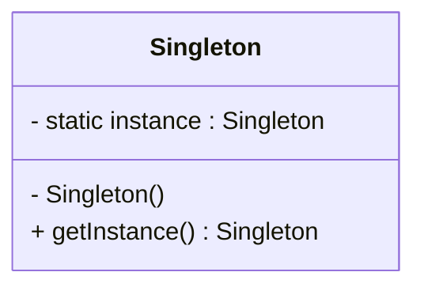

# Singleton Pattern

## Intent

Ensure a class has **only one instance** and provide a **global point of access** to it.

The Singleton Pattern restricts object creation so that only a single object exists throughout the lifetime of the application.

---

## Motivation

In many systems, certain components must have exactly one instance:

* Logging system
* Configuration manager
* Database connection pool
* Cache manager
* Thread pool manager

Without Singleton, multiple objects may lead to:

* Inconsistent state
* Excess memory usage
* Conflicting resource access

For example, multiple loggers writing to different files can break centralized logging.

---

## When to Use

* When exactly one instance is required in the system.
* When global access to a shared resource is needed.
* When object creation is expensive.
* When controlling access to shared resources.

### Examples

* Logger system
* Database connection manager
* Configuration loader
* File system manager
* Cache system

---

## UML Diagram



---

## Implementation

---

## Naive Version (Not Thread-Safe)

```cpp
#include <iostream>

using namespace std;

class Singleton {
private:
    static Singleton* instance;

    Singleton() {
        cout << "Singleton Constructor\n";
    }

public:
    Singleton(const Singleton&) = delete;
    Singleton& operator=(const Singleton&) = delete;

    static Singleton* getInstance() {
        if (instance == nullptr) {
            instance = new Singleton();
        }
        return instance;
    }

    void show() {
        cout << "Naive Singleton Working\n";
    }
};

Singleton* Singleton::instance = nullptr;

int main() {
    Singleton* s1 = Singleton::getInstance();
    Singleton* s2 = Singleton::getInstance();

    s1->show();

    cout << (s1 == s2) << endl;
}
```

---

## Problems of Naive Version

* Not thread-safe
* Risk of multiple instances in multithreading
* Memory leak (manual `new`)
* Difficult to manage lifecycle

---

## Correct / Modern Version (C++11+ Meyers Singleton)

```cpp
#include <iostream>

using namespace std;

class Singleton {
private:
    Singleton() {
        cout << "Singleton Constructor\n";
    }

public:
    Singleton(const Singleton&) = delete;
    Singleton& operator=(const Singleton&) = delete;

    static Singleton& getInstance() {
        static Singleton instance;  // thread-safe in C++11+
        return instance;
    }

    void show() {
        cout << "Modern Singleton Working\n";
    }
};

int main() {
    Singleton& s1 = Singleton::getInstance();
    Singleton& s2 = Singleton::getInstance();

    s1.show();

    cout << (&s1 == &s2) << endl;
}
```

---

## Advantages

* Ensures only one instance exists.
* Provides global access point.
* Lazy initialization (created only when needed).
* Saves system resources.
* Thread-safe in modern C++ (Meyers Singleton).

---

## Disadvantages

* Acts like global state (can be misused).
* Hard to unit test due to hidden dependencies.
* Violates Single Responsibility Principle.
* Can introduce tight coupling.
* Lifecycle management issues in older implementations.

---

## Key Points

* Constructor is **private**.
* Copy constructor and assignment operator are **deleted**.
* Instance is **static**.
* Access via `getInstance()`.

---
