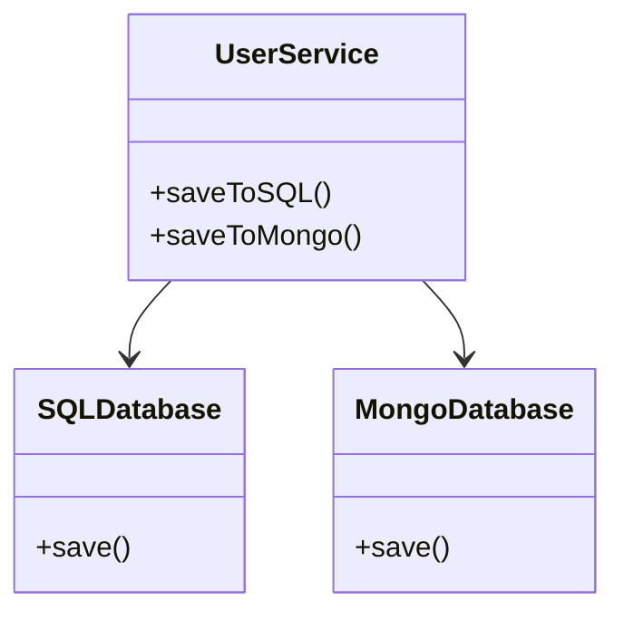
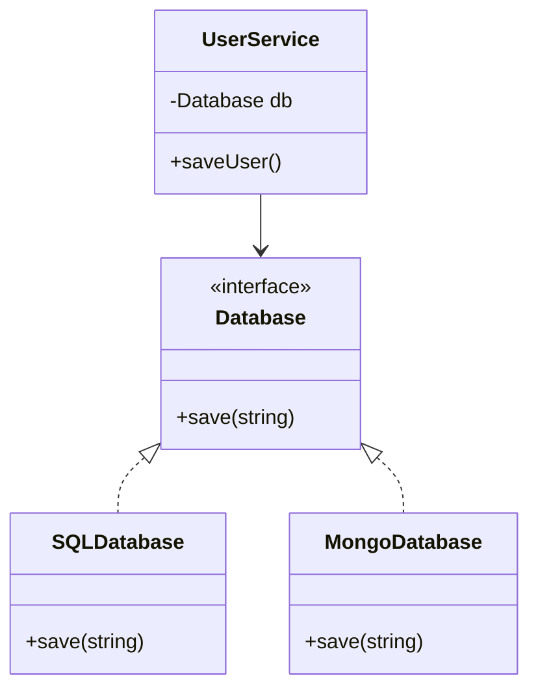

# Dependency Inversion Principle (DIP)

## Definition

High-level modules should not depend on low-level modules.  
Both should depend on abstractions.

Also:

- Abstractions should not depend on details  
- Details should depend on abstractions  

---

## DIP Violated

In this implementation, `UserService` directly depends on concrete database classes:

1. SQLDatabase
2. MongoDatabase

This creates tight coupling between high-level and low-level modules.

### UML Diagram

### Problems

- `UserService` depends on concrete implementations
- Adding a new database requires modifying `UserService`
- Violates Open/Closed Principle
- Hard to test and maintain
- Tight coupling between components

---

## DIP Followed

We introduce an abstraction called `Database`.

Now both high-level and low-level modules depend on the abstraction.

### UML Diagram

### Benefits

- Loose coupling between modules
- Easy to extend (add new DB without modifying service)
- Better testability (mock Database easily)
- Follows Open/Closed Principle
- Cleaner architecture design
- More scalable system

---