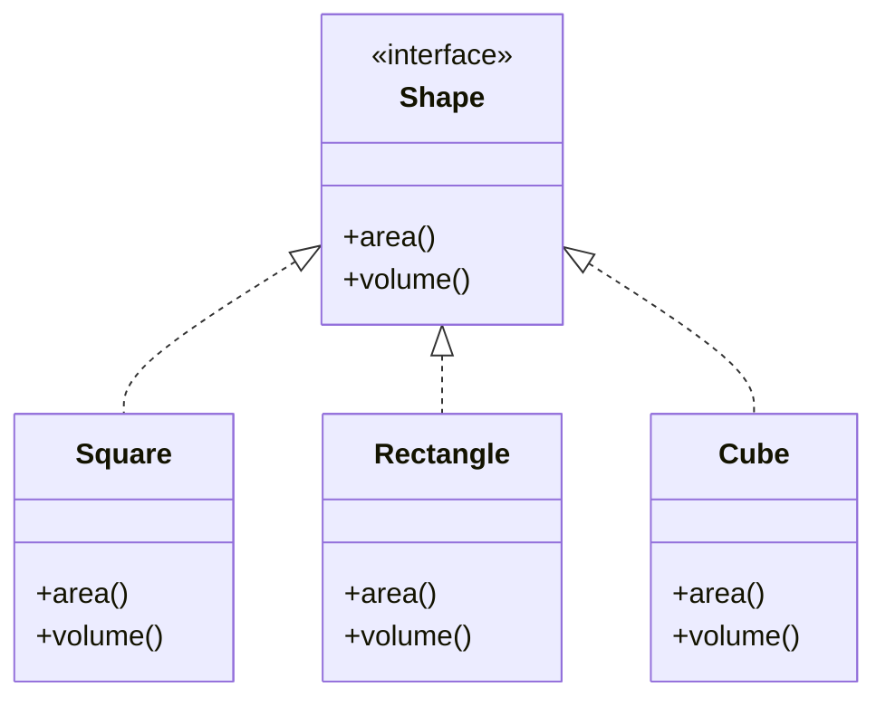
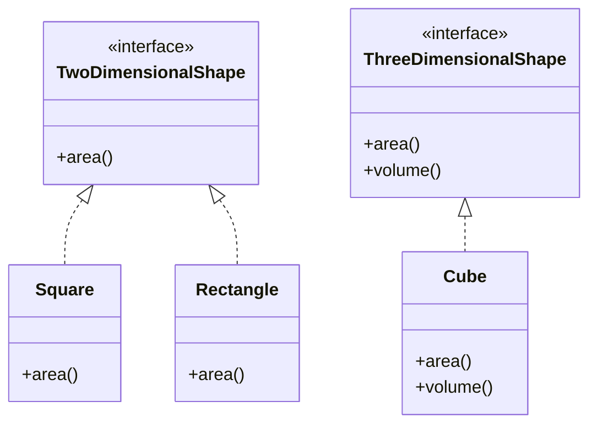

# Interface Segregation Principle (ISP)

## Definition

No client should be forced to depend on methods it does not use.

Instead of having large, general-purpose interfaces, we should split them into smaller, more specific interfaces so that classes only implement what they actually need.

---

## ISP Violated

In this implementation, we use a single interface `Shape` that forces all shapes to implement:

- `area()`
- `volume()`

This causes a problem for 2D shapes like `Square` and `Rectangle`, which do not naturally have a volume.

So they are forced to either:

- throw exceptions, or  
- provide meaningless implementations  

---

### Code Issue

```cpp
virtual double volume() = 0;
```

Used in a class where many implementations do not support it.

---

### UML Diagram



---

### Problems

- `Square` and `Rectangle` are forced to implement `volume()`
- They throw exceptions → runtime risk
- Violates logical correctness (2D shapes don’t have volume)
- Clients must handle unnecessary methods
- Interface is too fat (not role-specific)

---

## ISP Followed

We split the interface into smaller, more focused abstractions:

- `TwoDimensionalShape` → only `area()`
- `ThreeDimensionalShape` → `area()` + `volume()`

Now each class depends only on what it actually needs.

---

### UML Diagram



---

## Benefits

- No forced or irrelevant method implementations
- No runtime exceptions due to unsupported operations
- Better semantic modeling of real-world objects
- Easier to extend (new shapes don’t break existing ones)
- Cleaner and more maintainable design
- Lower coupling between unrelated behaviors

---