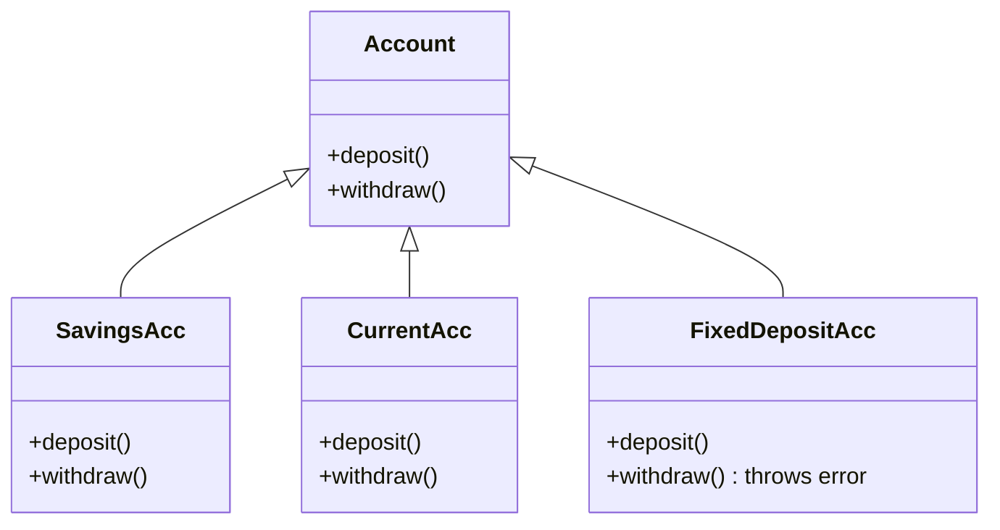
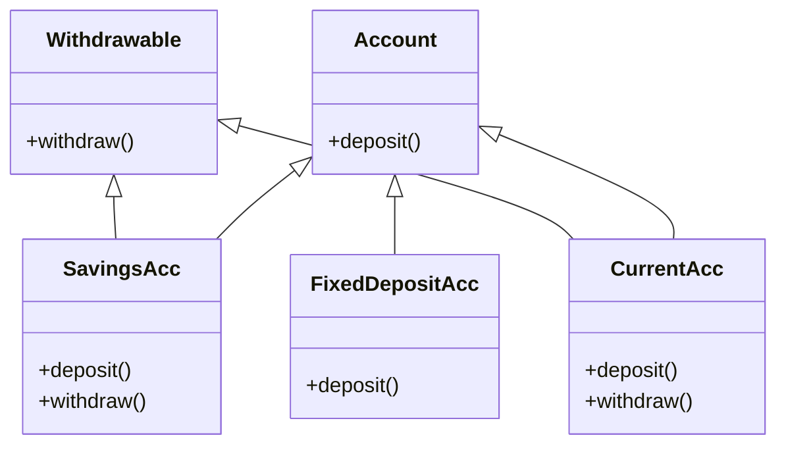

# Liskov Substitution Principle (LSP)

## Definition

Objects of a superclass should be replaceable with objects of its subclasses without breaking the application.

In simple terms:
 If class B is a subtype of class A, we should be able to use B wherever A is expected without unexpected behavior.

---

## LSP Violated

In this implementation, `Account` enforces both:

1. deposit()
2. withdraw()

However, not all accounts support withdrawal (e.g., `FixedDepositAcc`).

So to handle this:
- `FixedDepositAcc` throws an exception in `withdraw()`

### Problem

This breaks LSP because:
- A `FixedDepositAcc` **cannot be safely used wherever Account is expected**
- Client code must handle special cases or exceptions
- Subtypes are not truly substitutable

### UML Diagram



---

## “Wrong Fix” (Type Checking / Special Handling)

In this version, the client tries to fix the issue using type checking:

```cpp
if(typeid(*acc) == typeid(FixedDepositAcc)) {
    cout << "Skipping withdrawal";
}
```

### Problem

- Violates polymorphism
- Client becomes aware of concrete classes
- Breaks extensibility (new account types require modifying client)

---

## LSP Followed (Correct Design)

To fix this, we **split responsibilities**:

- `Account` → only deposit capability
- `Withdrawable` → only withdrawal capability

Now:
- Only accounts that support withdrawal implement `Withdrawable`

### UML Diagram



---

## BankClient Design

Now the client is clean:

- Deposits → all accounts
- Withdrawals → only withdrawable accounts

```cpp
vector<Account*> accounts;
vector<Withdrawable*> withdrawableAccounts;
```

### Benefits

- No runtime type checking
- No exceptions for unsupported behavior
- Fully polymorphic design
- True substitutability achieved

---

## Key Benefits of LSP Fix

- No unexpected behavior in subclasses
- No need for `typeid` or `if-else` hacks
- Better extensibility
- Cleaner architecture
- Safer polymorphism

---

## Key Takeaway

If a subclass requires the client to check its type or behavior explicitly,
 then LSP is violated.

Instead:
 Split interfaces based on behavior, not inheritance.

---