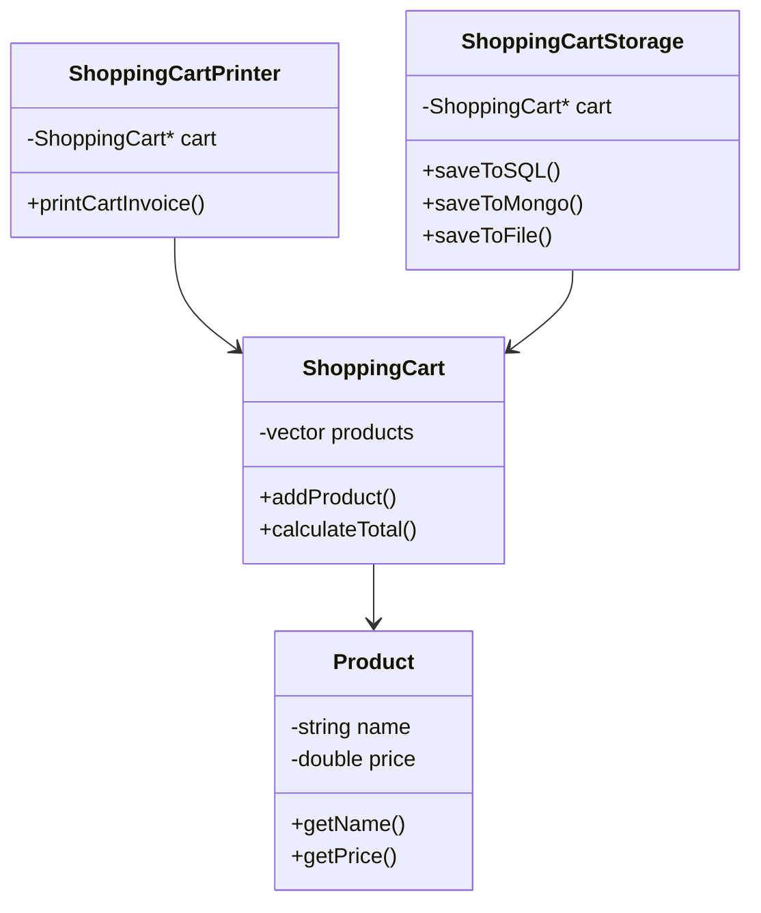
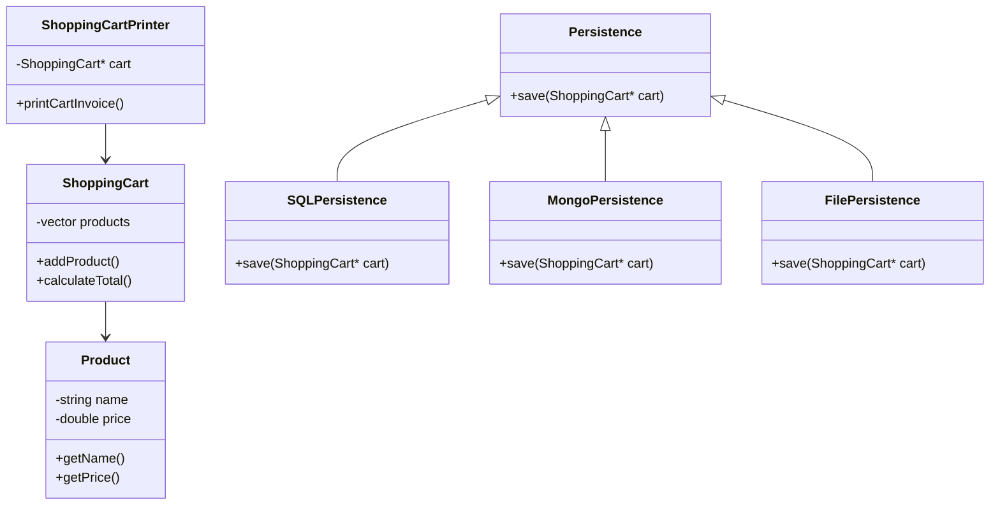

# Open/Closed Principle (OCP)

## Definition

Software entities (classes, modules, functions) should be **open for extension but closed for modification**.

This means you should be able to add new functionality without changing existing code.

---

## OCP Violated

In this implementation, `ShoppingCartStorage` directly handles multiple storage types:

1. SQL database storage
2. MongoDB storage
3. File storage

This violates OCP because every time a new storage type is added, the class must be modified.

### UML Diagram

### Problems

- Every new storage type requires modifying `ShoppingCartStorage`
- Class becomes larger and harder to maintain
- Violates Open/Closed Principle

---

## OCP Followed

To fix this, we introduce an abstraction `Persistence`.

Now storage logic is separated into independent classes:
- SQLPersistence
- MongoPersistence
- FilePersistence

Each class extends `Persistence` without modifying existing code.

### UML Diagram

### Benefits

- New storage types can be added without modifying existing code
- Follows Open/Closed Principle
- Better scalability
- Better separation of concerns
- Code becomes easier to maintain and extend

---