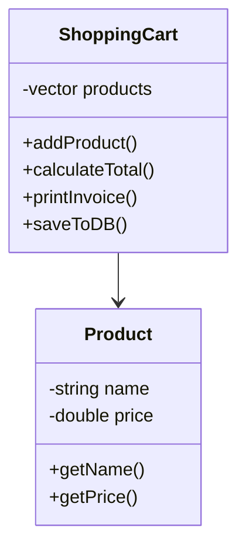
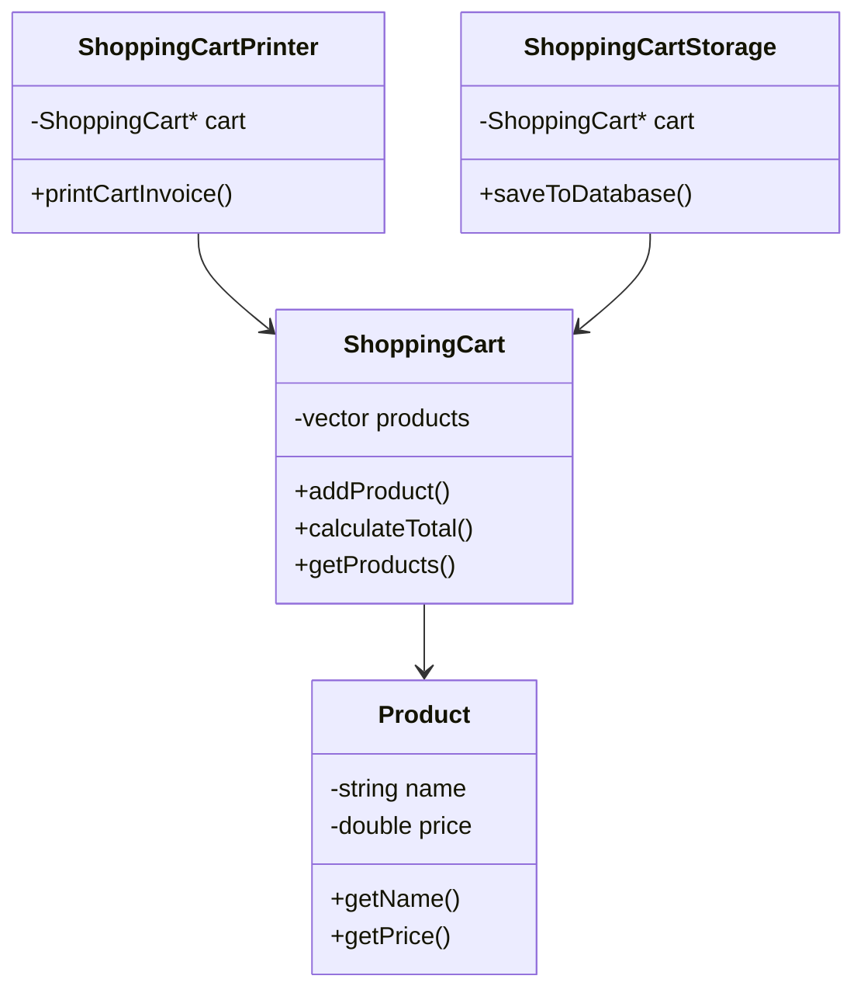

# Single Responsibility Principle (SRP)

## Definition

A class should have only one reason to change.

A class should do one job only.

If a class handles multiple responsibilities, changes in one responsibility can affect the others, making the code harder to maintain.

---

## SRP Violated

In this implementation, `ShoppingCart` is responsible for:

1. Managing products
2. Calculating totals
3. Printing invoices
4. Saving data to the database

This gives the class multiple reasons to change.

### UML Diagram

### Problems

- Changes to invoice format require modifying `ShoppingCart`
- Changes to database logic require modifying `ShoppingCart`
- Business logic and infrastructure concerns are mixed together

---

## SRP Followed

Responsibilities are separated:

- `ShoppingCart` → manages products and business logic
- `ShoppingCartPrinter` → prints invoices
- `ShoppingCartStorage` → handles persistence

### UML Diagram

### Benefits

- Easier maintenance
- Better testability
- Lower coupling
- Changes to printing or storage logic do not affect cart functionality

---

